# 01 — Motivation & Strategy Layer

Tầng Motivation và Strategy của BookedAI mô tả *vì sao* hệ thống tồn tại, *ai* được phục vụ, và *năng lực gì* cần được hiện thực hoá để biến demand thành revenue.

Nguồn: [project.md](../../../project.md), [target-platform-architecture.md](../target-platform-architecture.md), [solution-architecture-master-execution-plan.md](../solution-architecture-master-execution-plan.md), [bookedai-master-prd.md](../bookedai-master-prd.md).

## Tóm tắt định hướng

- **North Star**: `qualified enquiries that become traceable booking references with follow-up posture` (project.md).
- **Promise**: `BookedAI turns missed service enquiries into booked revenue`.
- **Category**: `AI Revenue Engine for Service Businesses` (omnichannel agent → booking core → operations truth).

## Diagram — Stakeholders, Drivers, Goals & Strategy

```plantuml
@startuml
!include <archimate/Archimate>

title BookedAI — Motivation & Strategy

rectangle "Motivation Layer" {
  Motivation_Stakeholder(sme, "Service SME Owner")
  Motivation_Stakeholder(customer, "End Customer")
  Motivation_Stakeholder(investor, "Investor / Judge")
  Motivation_Stakeholder(operator, "BookedAI Operator")

  Motivation_Driver(missedRev, "Missed Revenue from Slow Replies")
  Motivation_Driver(channelFrag, "Channel Fragmentation")
  Motivation_Driver(trustGap, "Trust Gap in AI Bookings")

  Motivation_Goal(captureDemand, "Capture Every Service Enquiry")
  Motivation_Goal(convertBooking, "Convert Enquiry to Booking + Payment")
  Motivation_Goal(operatorTruth, "Give Operators Audited Revenue Truth")

  Motivation_Principle(truthFirst, "AI is Mechanism, Not Source of Truth")
  Motivation_Principle(tenantSafe, "Tenant-Scoped by Default")
  Motivation_Principle(auditable, "Every Side Effect Auditable")
}

rectangle "Strategy Layer" {
  Strategy_Capability(demandCap, "Demand Capture")
  Strategy_Capability(matchCap, "AI Matching & Search")
  Strategy_Capability(bookCap, "Booking Conversion")
  Strategy_Capability(payCap, "Payment & Revenue Events")
  Strategy_Capability(recovCap, "Missed Revenue Recovery")
  Strategy_Capability(reportCap, "Reporting & Commission")

  Strategy_ValueStream(funnel, "Ask -> Match -> Book -> Confirm -> Portal -> Follow-up")
}

Rel_Influence(missedRev, captureDemand)
Rel_Influence(channelFrag, captureDemand)
Rel_Influence(trustGap, operatorTruth)

Rel_Influence(sme, missedRev)
Rel_Influence(customer, channelFrag)
Rel_Influence(investor, operatorTruth)

Rel_Realization(demandCap, captureDemand)
Rel_Realization(matchCap, convertBooking)
Rel_Realization(bookCap, convertBooking)
Rel_Realization(payCap, operatorTruth)
Rel_Realization(recovCap, captureDemand)
Rel_Realization(reportCap, operatorTruth)

Rel_Influence(truthFirst, matchCap)
Rel_Influence(tenantSafe, bookCap)
Rel_Influence(auditable, payCap)

Rel_Realization(funnel, convertBooking)
Rel_Aggregation(funnel, demandCap)
Rel_Aggregation(funnel, matchCap)
Rel_Aggregation(funnel, bookCap)
Rel_Aggregation(funnel, payCap)
@enduml
```

## Bình luận

### Stakeholders

| Stakeholder | Mục tiêu cốt lõi | Nguồn |
|---|---|---|
| Service SME Owner | Không bỏ sót enquiry, thấy revenue cụ thể | [target-platform-architecture.md](../target-platform-architecture.md) §"Tenant revenue workspace" |
| End Customer | Đặt dịch vụ nhanh, an toàn, có portal review | [DESIGN.md](../../../DESIGN.md) "Portal Workspace Override" |
| Investor / Judge | Hiểu wedge, proof, moat, scale | [project.md](../../../project.md) "Pitch and validation" |
| BookedAI Operator | Vận hành tenant, reconciliation, release gate | [admin-enterprise-workspace-requirements.md](../admin-enterprise-workspace-requirements.md) |

### Drivers chính

- **Missed Revenue** — SME đã có demand nhưng bị tuột vì chậm phản hồi.
- **Channel Fragmentation** — WhatsApp / SMS / Telegram / email / web chat không liên thông.
- **Trust Gap** — AI hứa hẹn nhưng không thể là source-of-truth cho booking/payment.

### Principles bắt buộc tuân thủ

Trích xuất từ `target-platform-architecture.md` §"Architecture principles":

1. Revenue outcomes là first-class domain.
2. AI là cơ chế, không phải source of truth.
3. Supabase Postgres là transaction & domain truth.
4. n8n là orchestration glue, không phải commercial brain.
5. Tất cả integration callback phải idempotent.
6. Attribution & commission phải explainable.
7. Public/tenant/admin phải đọc shared domain models.

### Capability vs Goal mapping

Mỗi capability ở Strategy layer hiện thực hoá ít nhất một Goal ở Motivation layer. Value stream `Ask → Match → Book → Confirm → Portal → Follow-up` là chuẩn UX cố định trong [DESIGN.md](../../../DESIGN.md) "Standard booking flow" — mọi surface phải bảo toàn flow này.

## Findings

- **F-01-01** — Có nhiều "phát biểu sản phẩm" khác nhau cho 3 nhóm khán giả (SME, Investor, Customer); cần được hợp nhất ở `project.md` §"Customer-facing message hierarchy" (đã được thực hiện).
- **F-01-02** — Principle "AI là cơ chế, không phải source of truth" đã hiện diện trong nhiều tài liệu nhưng chưa được lập trình hoá thành test/policy gate trên router AI; xem [12-architecture-review-findings.md](12-architecture-review-findings.md).
- **F-01-03** — Stakeholder `Tenant Admin` (operator của tenant) thực tế khác với `BookedAI Operator` (internal admin) — kiến trúc cần phân biệt rõ; [auth-rbac-multi-tenant-security-strategy.md](../auth-rbac-multi-tenant-security-strategy.md) đã đề cập nhưng chưa hoàn tất implement.
