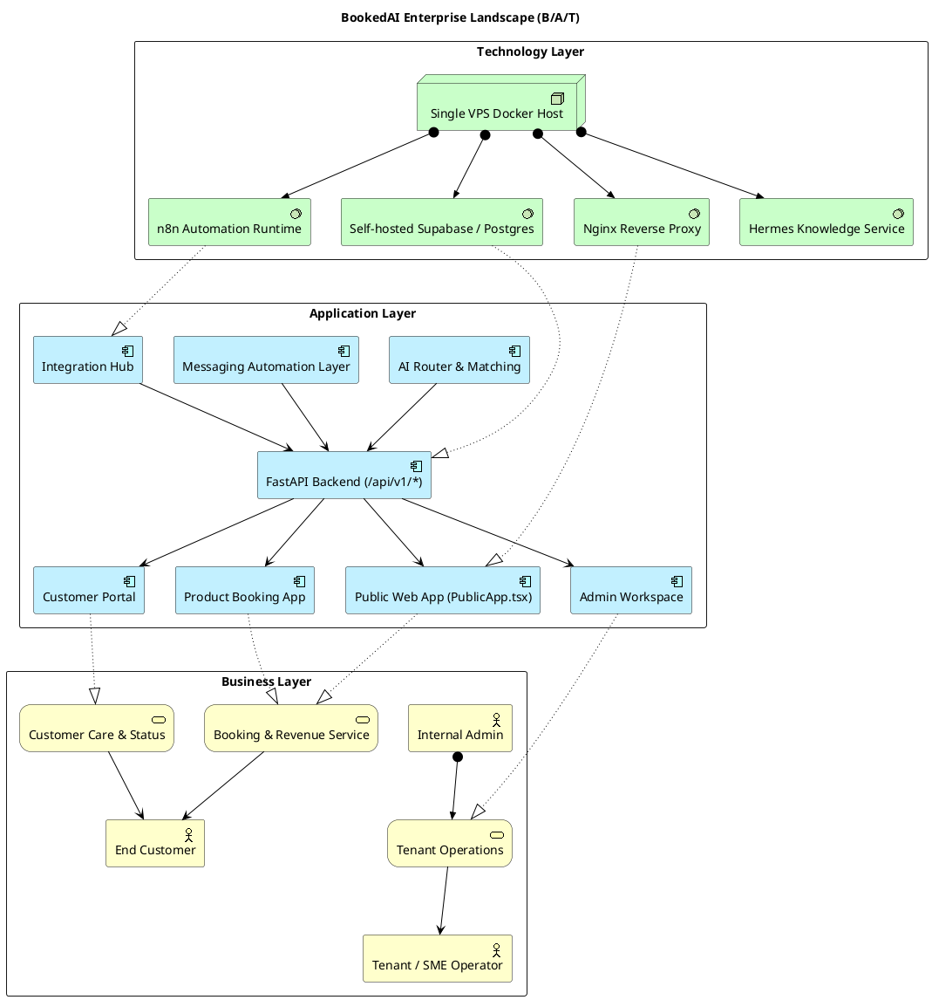

# 02 — Enterprise Landscape (Toàn cảnh B/A/T)

Sơ đồ landscape hợp nhất ba layer chính (Business / Application / Technology) để cho phép một người mới đọc nắm được cấu trúc tổng thể trong dưới 5 phút.

Nguồn: [system-overview.md](../system-overview.md), [target-platform-architecture.md](../target-platform-architecture.md), [module-hierarchy.md](../module-hierarchy.md), [solution-architecture-master-execution-plan.md](../solution-architecture-master-execution-plan.md).

## Diagram — BookedAI Enterprise Landscape

## Bình luận

### Cấu trúc tổng thể

BookedAI hiện chạy trên một mô hình **modular monolith trên một VPS Docker host** ([system-overview.md](../system-overview.md)) với:

- 1 frontend bundle React/Vite phục vụ nhiều subdomain (public, product, demo, portal, admin, beta).
- 1 FastAPI backend kết hợp request handling + AI router + integration hub.
- 1 Supabase tự host + 1 n8n + 1 Hermes — đều nằm trên cùng host và chia sẻ Docker network.

### Giải thích quan hệ chính

- **Business → Application**: mỗi business service được hiện thực hoá (`Rel_Realization`) bởi một hoặc nhiều application components. Booking & Revenue Service được cung cấp đồng thời bởi Public App, Product App và FastAPI backend.
- **Application → Application**: các UI app gọi `api` (`Rel_Serving`). AI router và Messaging Layer là service nội bộ của backend.
- **Application → Technology**: Nginx hiện thực hoá định tuyến cho front-end; Supabase hiện thực hoá `/api/v1/*` thông qua Postgres + Auth.

### Subdomain map (đối chiếu nhanh)

| Subdomain | Application Component |
|---|---|
| `bookedai.au` | Public Web App |
| `product.bookedai.au` | Product Booking App |
| `pitch.bookedai.au` | Pitch Deck App (xem 05) |
| `portal.bookedai.au` | Customer Portal |
| `admin.bookedai.au` | Admin Workspace |
| `tenant.bookedai.au` | Tenant Gateway (xem 05) |
| `api.bookedai.au` | FastAPI Backend |
| `n8n.bookedai.au` | n8n |
| `supabase.bookedai.au` | Supabase Kong gateway |

## Findings

- **F-02-01** — Một frontend bundle vẫn phục vụ tất cả surface ([module-hierarchy.md](../module-hierarchy.md) §"Refactor Status"). Khả năng cô lập (security, perf) còn hạn chế. Khuyến nghị tách build artifact theo subdomain.
- **F-02-02** — Backend vẫn ôm đa domain trong `services.py` và `route_handlers.py`; landscape diagram cần giữ ở mức cao, nhưng cần mô hình hoá rõ hơn ở [05-application-architecture.md](05-application-architecture.md).
- **F-02-03** — `beta.bookedai.au` được mô tả là rehearsal tier nhưng share DB với production ([devops-deployment-cicd-scaling-strategy.md](../devops-deployment-cicd-scaling-strategy.md)) — cần cô lập ở tầng dữ liệu.
