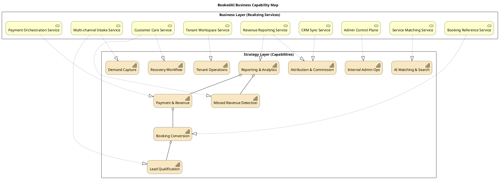

# 03 — Business Capability Map

Capability map mô tả "BookedAI có thể làm những gì" độc lập với cách triển khai. Mỗi capability được hiện thực hoá bởi một hoặc nhiều business service hiện hữu trong code và tài liệu.

Nguồn: [solution-architecture-master-execution-plan.md](../solution-architecture-master-execution-plan.md) §3.1, [target-platform-architecture.md](../target-platform-architecture.md) §"Core target domains", [analytics-metrics-revenue-bi-strategy.md](../analytics-metrics-revenue-bi-strategy.md).

## Diagram — Capability Map & Realizing Services

## Bình luận

### 11 capabilities cốt lõi

Đối chiếu với 7 capabilities trong [solution-architecture-master-execution-plan.md](../solution-architecture-master-execution-plan.md) §3.1, mô hình ArchiMate này mở rộng thêm:

- **Lead Qualification** (tách khỏi Demand Capture cho rõ).
- **AI Matching & Search** (rõ ràng là một capability, không trộn với Booking).
- **Tenant Operations** + **Internal Admin Ops** (phân biệt khán giả).

| Capability | Tài liệu nguồn |
|---|---|
| Demand Capture | [target-platform-architecture.md](../target-platform-architecture.md) §"Demand capture domain" |
| Lead Qualification | id. §"Lead qualification domain" |
| AI Matching & Search | [ai-router-matching-search-strategy.md](../ai-router-matching-search-strategy.md) |
| Booking Conversion | [target-platform-architecture.md](../target-platform-architecture.md) §"Booking conversion domain" |
| Payment & Revenue | id. §"Revenue event domain" |
| Missed Revenue Detection | id. §"Missed revenue domain" |
| Recovery Workflow | id. §"Recovery workflow domain" |
| Attribution & Commission | id. §"Attribution and commission domain" |
| Reporting & Analytics | [analytics-metrics-revenue-bi-strategy.md](../analytics-metrics-revenue-bi-strategy.md) |
| Tenant Operations | [admin-enterprise-workspace-requirements.md](../admin-enterprise-workspace-requirements.md), [tenant-app-strategy.md](../tenant-app-strategy.md) |
| Internal Admin Ops | id. + [internal-admin-app-strategy.md](../internal-admin-app-strategy.md) |

### Service-Capability ownership

Mỗi service có một owning capability chính (`Rel_Realization`). Một số service hiện thực hoá nhiều capability (ví dụ `Customer Care Service` cover cả Recovery và Missed Revenue) — đây là dấu hiệu cần phân tách thêm trong tương lai.

## Findings

- **F-03-01** — `Customer Care Service` đang ôm cả "missed revenue detection" và "recovery workflow"; cần tách hai khi audit ledger (Phase 18) ổn định.
- **F-03-02** — `Tenant Workspace Service` chưa có production implementation đầy đủ; tenant gateway tại `tenant.bookedai.au` mới ở giai đoạn auth + preview ([project.md](../../../project.md) "tenant login CTA fix").
- **F-03-03** — `Attribution & Commission` capability vẫn thiếu read model cụ thể trong code (xem [data-architecture-migration-strategy.md](../data-architecture-migration-strategy.md) §"Current weak spots").
