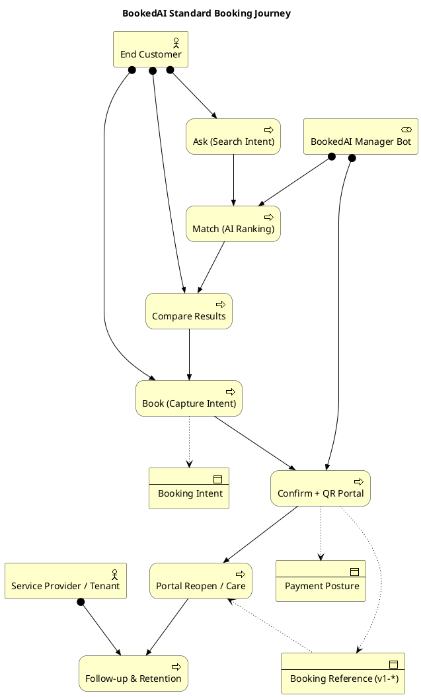
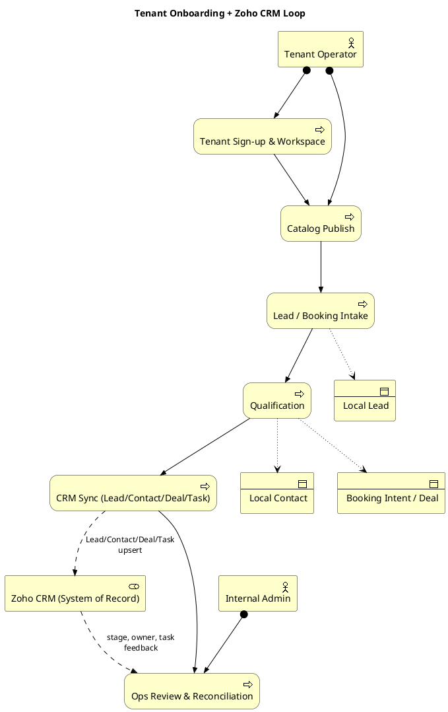

# 04 — Business Processes & Actors

Tầng Business mô tả *ai làm gì* khi BookedAI vận hành: customer journey, booking flow chính, onboarding tenant, và admin workflow.

Nguồn: [system-overview.md](../system-overview.md) §"Primary Runtime Flows", [DESIGN.md](../../../DESIGN.md) §"Standard booking flow", [admin-enterprise-workspace-requirements.md](../admin-enterprise-workspace-requirements.md), [zoho-crm-tenant-integration-blueprint.md](../zoho-crm-tenant-integration-blueprint.md).

## Diagram 1 — Standard Booking Flow (Customer Journey)

## Diagram 2 — Tenant Onboarding & CRM Loop

## Bình luận

### Booking flow là quy trình lõi

Quy trình `Ask → Match → Compare → Book → Confirm → Portal → Follow-up` là *bất biến* được [DESIGN.md](../../../DESIGN.md) ràng buộc cho mọi surface (public, product, Telegram, WhatsApp, web chat). Mọi UI thay đổi phải bảo toàn đầy đủ 7 bước này.

### Actor & Role

| Actor / Role | Trách nhiệm | Ghi chú |
|---|---|---|
| End Customer | Khởi tạo intent, xác nhận booking | Có thể đến từ web/Telegram/WhatsApp/email |
| BookedAI Manager Bot | Match, confirm, care | Là role AI, không phải actor con người |
| Service Provider / Tenant | Cung cấp dịch vụ, follow-up | Đại diện qua tenant workspace |
| Tenant Operator | Cấu hình tenant, publish catalog | Khác với Internal Admin |
| Internal Admin | Reconciliation, support, release | RBAC `super_admin`/`ops`/`support`/`billing_ops`/`integration_support` |

### Tenant onboarding loop

Trong sơ đồ 2, BookedAI giữ vai *system of action* (intake, qualify), Zoho giữ vai *system of record* (commercial pipeline). Đây là biên giới được nhấn mạnh trong [zoho-crm-tenant-integration-blueprint.md](../zoho-crm-tenant-integration-blueprint.md) §2 và [target-platform-architecture.md](../target-platform-architecture.md) §"CRM intelligence loop".

### Sự kiện then chốt

- **Booking Intent created** — Khi customer xác nhận `Book` trên một result, hệ thống tạo `booking_intents` và `Booking Reference` theo format `v1-*`.
- **Payment Posture mirrored** — Stripe / QR / manual đều được hệ thống ghi nhận thành `Payment Posture` (chứ không phải payment-confirmed) cho đến khi callback từ provider xác nhận.
- **Portal Reopen** — Khi customer mở `portal.bookedai.au/<reference>`, hệ thống chạy `build_portal_booking_snapshot`.

## Findings

- **F-04-01** — Workflow tenant onboarding chưa tự động hoá đầy đủ (catalog publish vẫn cần admin import). Phase 22 (multi-tenant template) sẽ chuẩn hoá.
- **F-04-02** — Bước `Confirm + QR Portal` có rủi ro hiển thị state sai khi backend trả về `qr_code_url` rỗng — frontend hiện fallback generate QR từ portal URL ([DESIGN.md](../../../DESIGN.md) "Verified Tenant Search Requirement").
- **F-04-03** — Mapping `Lead → Contact → Deal → Task` trong Zoho cần gating qualification rõ ràng để tránh tạo Deal cho enquiry chưa đủ commercial value ([zoho-crm-tenant-integration-blueprint.md](../zoho-crm-tenant-integration-blueprint.md) §3 "Qualification").
