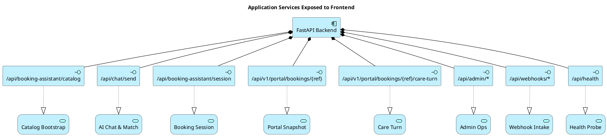

# 05 — Application Architecture

Tầng Application liệt kê các thành phần phần mềm chính, dịch vụ ứng dụng, và data object — tách thành sub-views để dễ đọc.

Nguồn: [system-overview.md](../system-overview.md), [module-hierarchy.md](../module-hierarchy.md), [api-architecture-contract-strategy.md](../api-architecture-contract-strategy.md), [ai-router-matching-search-strategy.md](../ai-router-matching-search-strategy.md), [admin-enterprise-workspace-requirements.md](../admin-enterprise-workspace-requirements.md).

## Diagram 1 — Frontend Surfaces

```plantuml
@startuml
!include <archimate/Archimate>

title Frontend Application Components

rectangle "Public-facing apps" {
  Application_Component(publicApp, "PublicApp.tsx (bookedai.au)")
  Application_Component(homeSearch, "HomepageSearchExperience")
  Application_Component(productApp, "ProductApp.tsx (product.bookedai.au)")
  Application_Component(pitchApp, "PitchDeckApp.tsx (pitch.bookedai.au)")
  Application_Component(demoApp, "DemoLandingApp.tsx (demo.bookedai.au)")
  Application_Component(portal, "Customer Portal (portal.bookedai.au)")
  Application_Component(tenantGw, "Tenant Gateway (tenant.bookedai.au)")
  Application_Component(adminApp, "AdminApp.tsx (admin.bookedai.au)")
}

rectangle "Shared frontend" {
  Application_Component(bookingDlg, "BookingAssistantDialog")
  Application_Component(apiClient, "shared/config/api.ts")
  Application_Component(designSys, "Apple Design Tokens")
}

Rel_Composition(publicApp, homeSearch)
Rel_Composition(publicApp, bookingDlg)
Rel_Composition(productApp, bookingDlg)
Rel_Used(publicApp, apiClient)
Rel_Used(productApp, apiClient)
Rel_Used(adminApp, apiClient)
Rel_Used(portal, apiClient)
Rel_Used(tenantGw, apiClient)
Rel_Used(publicApp, designSys)
Rel_Used(adminApp, designSys)
@enduml
```

## Diagram 2 — Backend Services & AI Router

```plantuml
@startuml
!include <archimate/Archimate>

title Backend Modular Monolith — Services View

rectangle "FastAPI Layer" {
  Application_Component(routesAgg, "api/routes.py (aggregator)")
  Application_Component(publicR, "public_routes.py")
  Application_Component(adminR, "admin_routes.py")
  Application_Component(autoR, "automation_routes.py")
  Application_Component(emailR, "email_routes.py")
  Application_Component(handlers, "route_handlers.py (legacy)")
}

rectangle "Service Layer" {
  Application_Component(eventStore, "event_store.py")
  Application_Component(tenantSvc, "tenant_app_service.py")
  Application_Component(msgAuto, "MessagingAutomationService")
  Application_Component(coreSvc, "services.py (legacy mega-module)")
}

rectangle "AI Router" {
  Application_Component(aiSvc, "domain/ai_router/service.py")
  Application_Service(matchSvc, "Service Matching")
  Application_Service(extractSvc, "Intent Extraction")
  Application_Service(rankSvc, "Ranking & Confidence")
  Application_Service(trustGate, "Booking Trust Gate")
}

Rel_Composition(routesAgg, publicR)
Rel_Composition(routesAgg, adminR)
Rel_Composition(routesAgg, autoR)
Rel_Composition(routesAgg, emailR)

Rel_Used(publicR, handlers)
Rel_Used(adminR, handlers)
Rel_Used(autoR, handlers)
Rel_Used(emailR, handlers)

Rel_Used(handlers, eventStore)
Rel_Used(handlers, tenantSvc)
Rel_Used(handlers, msgAuto)
Rel_Used(handlers, coreSvc)

Rel_Used(coreSvc, aiSvc)
Rel_Composition(aiSvc, matchSvc)
Rel_Composition(aiSvc, extractSvc)
Rel_Composition(aiSvc, rankSvc)
Rel_Composition(aiSvc, trustGate)
@enduml
```

## Diagram 3 — Application Services & Interfaces



## Bình luận

### Frontend

- 7 surface chính chia sẻ một bundle build (`frontend/`), router chính ở `src/app/AppRouter.tsx` ([module-hierarchy.md](../module-hierarchy.md)).
- `BookingAssistantDialog` là component dùng chung cho cả `PublicApp` và `ProductApp`.
- `shared/config/api.ts` đã được centralize để giải quyết base URL cho mỗi subdomain.

### Backend

- FastAPI **modular monolith**, route registration tách theo domain (public/admin/automation/email).
- `route_handlers.py` còn ôm phần lớn logic — đây là *technical debt* được nhắc trong [api-architecture-contract-strategy.md](../api-architecture-contract-strategy.md).
- `services.py` là legacy mega-module, đang được dần tách sang `service_layer/`.
- AI Router đã có seam tại `backend/domain/ai_router/service.py` ([ai-router-matching-search-strategy.md](../ai-router-matching-search-strategy.md) §"Confirmed current-repo reality").

### MessagingAutomationService (key new component)

`MessagingAutomationService` là layer mới (Phase 19) hợp nhất chính sách booking-care cho web chat / Telegram / WhatsApp / SMS / email — thay vì để policy phân tán ở từng webhook handler. Giao tiếp:
```
channel webhook -> Inbox/conversation_events -> AI booking-care policy -> workflow/audit/outbox -> provider reply
```

### Interface inventory (đối chiếu API contract)

API hiện được nhóm thành các interface ổn định:

| Interface | Caller | Risk if changed |
|---|---|---|
| `/api/booking-assistant/catalog` | Booking UI | High |
| `/api/chat/send` (alias `/api/booking-assistant/chat`) | Web chat | Critical |
| `/api/booking-assistant/session` | Booking UI | Very High |
| `/api/v1/portal/bookings/{ref}` | Portal UI | Critical |
| `/api/v1/portal/bookings/{ref}/care-turn` | Portal care agent | High |
| `/api/admin/*` | Admin UI | High |
| `/api/webhooks/*` | Stripe, Telegram, WhatsApp, Tawk, n8n | Very High |

## Findings

- **F-05-01** — Backend còn 2 "mega-modules" (`services.py`, `route_handlers.py`) trộn nhiều bounded context; tách dần theo lộ trình trong [11-migration-planning.md](11-migration-planning.md).
- **F-05-02** — Frontend chưa tách build artifact theo audience (public vs admin vs portal), gây rủi ro vô tình lộ admin code path qua public bundle.
- **F-05-03** — Webhook interface (`/api/webhooks/*`) chưa thống nhất idempotency contract; chỉ một số endpoint (Stripe, Telegram secret token) có verification chuẩn.
- **F-05-04** — `BookingAssistantDialog` là component cốt lõi nhưng đang sống trong `components/landing/assistant/` — không phải chỗ phù hợp cho component dùng chung; cần chuyển vào `shared/`.
