# 06 — Data Architecture

Tầng dữ liệu mô tả các domain object chính, quyền sở hữu, và dòng đọc/ghi giữa các application component.

Nguồn: [data-architecture-migration-strategy.md](../data-architecture-migration-strategy.md), [target-platform-architecture.md](../target-platform-architecture.md) §"Key data architecture requirements", [zoho-crm-tenant-integration-blueprint.md](../zoho-crm-tenant-integration-blueprint.md).

## Diagram — Data Objects, Ownership & Access Flows

```plantuml
@startuml
!include <archimate/Archimate>

title BookedAI Data Architecture (Read/Write Flows)

rectangle "Application Components" {
  Application_Component(publicApi, "Public API Handlers")
  Application_Component(adminApi, "Admin API Handlers")
  Application_Component(portalApi, "Portal API Handlers")
  Application_Component(aiRouter, "AI Router")
  Application_Component(msgAuto, "Messaging Automation")
  Application_Component(crmSync, "CRM Sync Worker")
  Application_Component(eventStore, "Event Store")
}

rectangle "Core Data Objects (Postgres / Supabase)" {
  Application_DataObject(tenant, "tenants")
  Application_DataObject(catalog, "service_merchant_profiles")
  Application_DataObject(partner, "partner_profiles")
  Application_DataObject(events, "conversation_events (legacy)")
  Application_DataObject(bookingIntent, "booking_intents")
  Application_DataObject(bookingRef, "booking_references (v1-*)")
  Application_DataObject(payment, "payment_postures")
  Application_DataObject(audit, "audit_outbox")
  Application_DataObject(crmRec, "crm_sync_records")
  Application_DataObject(msgSession, "messaging_channel_sessions")
}

Rel_Access_r(publicApi, catalog)
Rel_Access_r(publicApi, partner)
Rel_Access_w(publicApi, events)
Rel_Access_w(publicApi, bookingIntent)
Rel_Access_w(publicApi, bookingRef)

Rel_Access_r(portalApi, bookingRef)
Rel_Access_r(portalApi, payment)
Rel_Access_w(portalApi, audit)

Rel_Access_r(adminApi, tenant)
Rel_Access_r(adminApi, bookingRef)
Rel_Access_r(adminApi, audit)
Rel_Access_w(adminApi, catalog)
Rel_Access_w(adminApi, partner)

Rel_Access_r(aiRouter, catalog)
Rel_Access_r(aiRouter, msgSession)

Rel_Access_w(msgAuto, msgSession)
Rel_Access_w(msgAuto, events)
Rel_Access_w(msgAuto, audit)

Rel_Access_w(crmSync, crmRec)
Rel_Access_r(crmSync, bookingIntent)

Rel_Access_w(eventStore, events)
@enduml
```

## Bình luận

### Tình trạng hiện tại (theo `data-architecture-migration-strategy.md`)

Schema hiện tại còn nông:

- ORM tables xác nhận: `conversation_events`, `partner_profiles`, `service_merchant_profiles`.
- Phần lớn booking / payment / workflow truth được nhồi vào `conversation_events.metadata_json`.
- Chưa có tenant_id cho mọi bảng — về cơ bản còn single-tenant.
- Đã thêm các bảng phụ trợ cho phase mới: `crm_sync_records`, `messaging_channel_sessions`, `booking_intents`, `tenant_email_login_codes`, `admin_email_login_codes` (theo các phase 17–19).

### Quyền sở hữu (ownership matrix)

| Data Object | System of Record | Ghi nhận / mở rộng từ |
|---|---|---|
| `tenants` | BookedAI | (target) — chưa hoàn tất multi-tenant cutover |
| `service_merchant_profiles` | BookedAI (tenant-scoped target) | Existing |
| `partner_profiles` | BookedAI | Existing |
| `conversation_events` | BookedAI (raw event log) | Existing — giữ làm audit trail |
| `booking_intents` | BookedAI | Phase 19 |
| `booking_references` | BookedAI | Implied (v1-* format) |
| `payment_postures` | BookedAI ↔ Stripe (provider truth on confirmation) | Phase 18 |
| `audit_outbox` | BookedAI | Phase 18 |
| `crm_sync_records` | BookedAI (state) ↔ Zoho (record) | [zoho-crm-tenant-integration-blueprint.md](../zoho-crm-tenant-integration-blueprint.md) |
| `messaging_channel_sessions` | BookedAI | Phase 19 (Telegram shortlist continuity) |

### Read models cần thiết

[target-platform-architecture.md](../target-platform-architecture.md) §"Read models required" liệt kê:
- revenue_generated_this_month
- total_bookings, average_booking_value
- search_to_booking_conversion / call_to_booking / email_to_booking
- missed_revenue_estimate
- recovered_opportunities
- payment_completion_status
- commission_summary

Phần lớn các read model này **chưa có schema chuyên biệt**; vẫn được tính từ `conversation_events`.

### Nguyên tắc đọc/ghi

1. **Tenant-scoped by default** — mọi query repository nhận `tenant_id` tường minh ([auth-rbac-multi-tenant-security-strategy.md](../auth-rbac-multi-tenant-security-strategy.md) §5).
2. **Dual-write before read cutover** — khi tách `conversation_events.metadata_json` ra bảng chuyên biệt, phải dual-write một thời gian rồi mới chuyển read.
3. **AI is not a writer of truth** — `AI Router` chỉ đọc; mọi side effect (booking, payment, CRM sync) phải đi qua handler chuyên biệt.
4. **Idempotency keys** — webhook và outbox writes phải có dedupe key.

## Findings

- **F-06-01** — `conversation_events.metadata_json` vẫn là *de-facto truth* cho booking và payment — rủi ro lớn nhất về data integrity. Phase 18 (audit ledger) phải tách rõ.
- **F-06-02** — Chưa có bảng `tenants` đầy đủ; cutover đơn-tenant → đa-tenant phải bắt đầu bằng default tenant + dual-read.
- **F-06-03** — Read model cho commission/attribution chưa được hiện thực hoá thành bảng — analytics layer hiện chỉ ở [analytics-metrics-revenue-bi-strategy.md](../analytics-metrics-revenue-bi-strategy.md) ở mức kế hoạch.
- **F-06-04** — Uploads vẫn là filesystem (`storage/uploads`), không phải object storage; cần migration qua Supabase storage hoặc S3-compatible.
