# 07 — Integration Architecture

Mô hình tích hợp giữa BookedAI và các hệ thống bên ngoài: CRM, payment gateway, email, messaging providers, n8n, MCP servers.

Nguồn: [integration-hub-sync-architecture.md](../integration-hub-sync-architecture.md), [zoho-crm-tenant-integration-blueprint.md](../zoho-crm-tenant-integration-blueprint.md), [crm-email-revenue-lifecycle-strategy.md](../crm-email-revenue-lifecycle-strategy.md), `project.md` §"Messaging Automation Layer".

## Diagram — Integration Hub & External Systems

```plantuml
@startuml
!include <archimate/Archimate>

title BookedAI Integration Architecture

rectangle "BookedAI Core" {
  Application_Component(api, "FastAPI Backend")
  Application_Component(integHub, "Integration Hub Adapters")
  Application_Component(msgAuto, "Messaging Automation")
  Application_Component(workerOutbox, "Outbox Worker")
  Application_Component(n8nFlows, "n8n Workflow Engine")
}

rectangle "External Systems" {
  Application_Component(zoho, "Zoho CRM")
  Application_Component(stripe, "Stripe")
  Application_Component(zohoMail, "Zoho Mail SMTP/IMAP")
  Application_Component(zohoCal, "Zoho Calendar")
  Application_Component(telegram, "Telegram Bot API")
  Application_Component(whatsapp, "WhatsApp (Meta / Twilio)")
  Application_Component(tawk, "Tawk Chat Widget")
  Application_Component(openai, "OpenAI / OpenAI-compatible")
  Application_Component(googleMaps, "Google Maps Static")
  Application_Component(cloudflare, "Cloudflare DNS")
  Application_Component(mcpServers, "MCP Servers (n8n-mcp, etc.)")
}

Rel_Flow(integHub, zoho, "OAuth + Upsert (Lead/Contact/Deal/Task)")
Rel_Flow(zoho, integHub, "actions/watch notifications")

Rel_Flow(integHub, stripe, "Checkout Session create")
Rel_Flow(stripe, api, "webhook (payment_intent.*)")

Rel_Flow(integHub, zohoMail, "SMTP send")
Rel_Flow(zohoMail, integHub, "IMAP fetch")
Rel_Flow(integHub, zohoCal, "iCal/Calendar API")

Rel_Flow(msgAuto, telegram, "sendMessage / inline keyboard")
Rel_Flow(telegram, msgAuto, "webhook /api/webhooks/bookedai-telegram")
Rel_Flow(msgAuto, whatsapp, "send message")
Rel_Flow(whatsapp, msgAuto, "webhook /api/webhooks/whatsapp|evolution|twilio")
Rel_Flow(tawk, api, "webhook /api/webhooks/tawk")

Rel_Flow(api, openai, "chat/extract/search")
Rel_Flow(api, googleMaps, "static map URL")

Rel_Flow(workerOutbox, integHub, "side-effect dispatch")
Rel_Flow(n8nFlows, api, "callback /api/automation/booking-callback")
Rel_Flow(api, n8nFlows, "trigger workflow")

Rel_Flow(cloudflare, api, "DNS + edge")
Rel_Flow(mcpServers, api, "tool calls (operator/dev path)")
@enduml
```



## Bình luận

### Phân loại integration (theo `integration-hub-sync-architecture.md`)

| Loại | Ví dụ | Ownership | Sync mode | Risk |
|---|---|---|---|---|
| CRM | Zoho CRM | Zoho = commercial truth, BookedAI = ops truth | Bi-directional with guardrails | High |
| Payment | Stripe | Provider = confirmation, BookedAI = path/state | Mixed event-driven | Very High |
| Communication | Zoho Mail, Telegram, WhatsApp | Provider = transport, BookedAI = intent | Write-back + provider callback | Medium-High |
| Search/Grounding | OpenAI, Google Maps | External = facts only | Read-only | Medium |
| Edge | Cloudflare | External | Read-only DNS | Low |
| Operator tooling | MCP servers (n8n-mcp), OpenClaw | Internal | N/A | Low (but must not share customer scope) |

### Nguyên tắc bắt buộc

1. **Adapter-first** — mỗi external system có một adapter cô lập trong `integration_hub`, không gọi trực tiếp từ business logic.
2. **Local-state-first** — luôn ghi local trước (CRM sync ledger, outbox), rồi mới đồng bộ ra ngoài.
3. **Idempotent writes** — mọi callback (Stripe webhook, Telegram update, n8n callback) phải dedupe theo provider event id.
4. **Verification** — webhook phải có signature/secret token verification trước khi xử lý:
   - Stripe — signature
   - Telegram — `X-Telegram-Bot-Api-Secret-Token` (`BOOKEDAI_CUSTOMER_TELEGRAM_WEBHOOK_SECRET_TOKEN`)
   - WhatsApp Evolution — HMAC `X-BookedAI-Signature` / `X-Hub-Signature-256` (`WHATSAPP_EVOLUTION_WEBHOOK_SECRET`)
   - n8n — bearer secret
5. **Channel separation** — `BookedAI Manager Bot` (customer agent) phải tách hoàn toàn khỏi OpenClaw (operator agent): không share token, không share webhook route.

### Messaging Automation Layer (Phase 19)

Tất cả channel đều đi qua một policy chung:

```
Customer message → channel webhook → BookedAI Inbox / conversation_events
   → AI booking-care policy → workflow / audit / outbox side effects → provider reply
```

Channel-specific webhooks:

| Channel | Webhook | Bot identity |
|---|---|---|
| Web chat | `/api/chat/send` (alias `/api/booking-assistant/chat`) | inline (no bot identity) |
| Telegram | `/api/webhooks/bookedai-telegram` (compat alias `/api/webhooks/telegram`) | `@BookedAI_Manager_Bot` |
| WhatsApp | `/api/webhooks/whatsapp` / `/api/webhooks/evolution` / Twilio path | `+61455301335` |
| Tawk | `/api/webhooks/tawk` | site widget |
| n8n callback | `/api/automation/booking-callback` | n8n bearer |

## Findings

- **F-07-01** — Stripe webhook hiện được đề cập nhiều nhưng implementation chi tiết chưa được audit — cần kiểm tra dedupe và replay protection ([integration-hub-sync-architecture.md](../integration-hub-sync-architecture.md) §"Webhook security").
- **F-07-02** — Zoho integration mới ở mức blueprint; OAuth server-side flow chưa hoàn tất production rollout cho mọi tenant.
- **F-07-03** — n8n vẫn được dùng làm "cầu nối" — đây là trade-off; cần đảm bảo `n8n` không trở thành "commercial brain" theo principle ở `target-platform-architecture.md`.
- **F-07-04** — MCP servers (n8n-mcp, claude-api) có thể truy cập internal API — cần phân biệt rạch ròi giữa operator-only và public; OpenClaw phải không có repo-write/host-shell trên customer agent path.
- **F-07-05** — Email lifecycle (operator onboarding, booking customer flows, lead nurture, tenant retention) mới ở giai đoạn kế hoạch ([crm-email-revenue-lifecycle-strategy.md](../crm-email-revenue-lifecycle-strategy.md)) — cần định danh segment, trigger, attribution trước khi automation thật sự go-live.
