# 11 — Migration Planning (Plateaus, Work Packages, Gaps)

Tầng Implementation & Migration mô tả lộ trình từ trạng thái hiện tại tới target architecture, được phân theo plateau (mốc dừng có ý nghĩa) và work package (gói việc).

Nguồn: [implementation-phase-roadmap.md](../implementation-phase-roadmap.md), [bookedai-master-roadmap-2026-04-26.md](../bookedai-master-roadmap-2026-04-26.md), [solution-architecture-master-execution-plan.md](../solution-architecture-master-execution-plan.md), `project.md` §"Current phase sequence".

## Diagram — Plateaus & Work Packages

```plantuml
@startuml
!include <archimate/Archimate>

title Migration Roadmap — Current → Target

rectangle "Plateaus" {
  Implementation_Plateau(p_now, "Current State (Phase 17 baseline)")
  Implementation_Plateau(p_ledger, "Plateau A — Revenue Ops Ledger")
  Implementation_Plateau(p_msg, "Plateau B — Unified Messaging Layer")
  Implementation_Plateau(p_widget, "Plateau C — Widget + Wallet")
  Implementation_Plateau(p_billing, "Plateau D — Billing & Receivables")
  Implementation_Plateau(p_tenant, "Plateau E — Multi-tenant Templates")
  Implementation_Plateau(p_release, "Plateau F — Release Governance")
}

rectangle "Work Packages" {
  Implementation_WorkPackage(wp17, "Phase 17: Full-flow stabilization")
  Implementation_WorkPackage(wp18, "Phase 18: Revenue-ops ledger control")
  Implementation_WorkPackage(wp19, "Phase 19: Customer-care + status agent")
  Implementation_WorkPackage(wp20, "Phase 20: Widget & plugin runtime")
  Implementation_WorkPackage(wp205, "Phase 20.5: Wallet + Stripe return")
  Implementation_WorkPackage(wp21, "Phase 21: Billing + receivables")
  Implementation_WorkPackage(wp22, "Phase 22: Tenant template generalization")
  Implementation_WorkPackage(wp23, "Phase 23: Release governance + scale")
}

rectangle "Cross-cutting Gaps" {
  Implementation_Deliverable(g_tenant, "Multi-tenant cutover (tenants table + RLS)")
  Implementation_Deliverable(g_audit, "Audit Outbox + Idempotency")
  Implementation_Deliverable(g_obs, "Observability (metrics + traces)")
  Implementation_Deliverable(g_ci, "Automated CI Pipeline")
  Implementation_Deliverable(g_backup, "Backup & Restore Drill")
}

Rel_Triggering(p_now, wp17)
Rel_Triggering(wp17, wp18)
Rel_Triggering(wp18, p_ledger)
Rel_Triggering(p_ledger, wp19)
Rel_Triggering(wp19, p_msg)
Rel_Triggering(p_msg, wp20)
Rel_Triggering(wp20, wp205)
Rel_Triggering(wp205, p_widget)
Rel_Triggering(p_widget, wp21)
Rel_Triggering(wp21, p_billing)
Rel_Triggering(p_billing, wp22)
Rel_Triggering(wp22, p_tenant)
Rel_Triggering(p_tenant, wp23)
Rel_Triggering(wp23, p_release)

Rel_Influence(g_tenant, wp22)
Rel_Influence(g_audit, wp18)
Rel_Influence(g_obs, wp23)
Rel_Influence(g_ci, wp23)
Rel_Influence(g_backup, wp23)
@enduml
```

## Bình luận

### Plateau definitions

| Plateau | Trạng thái mong đợi |
|---|---|
| **Current** | Phase 17 baseline đã đóng: UI/UX, search, booking, confirm, QR/portal đã ổn định |
| **A — Revenue Ops Ledger** | Mọi post-booking action inspectable, replay-safe, policy-gated |
| **B — Unified Messaging** | Web, Telegram, WhatsApp, SMS, email chia sẻ một booking-care policy |
| **C — Widget + Wallet** | BookedAI có thể nhúng vào website của SME; wallet/Stripe return hoạt động |
| **D — Billing & Receivables** | Payment, reminders, receivables, tenant billing, commission, subscription đều liên thông |
| **E — Multi-tenant Templates** | Chess, Future Swim, event proof → template tái sử dụng |
| **F — Release Governance** | Capture-to-retention verification mandatory cho mọi promote |

### Work package mapping (đối chiếu phase trong `project.md`)

- **Phase 17** → Plateau Current.
- **Phase 18** → Plateau A (audit ledger là deliverable cốt lõi).
- **Phase 19** → Plateau B.
- **Phase 20 + 20.5** → Plateau C.
- **Phase 21** → Plateau D.
- **Phase 22** → Plateau E.
- **Phase 23** → Plateau F.

### Cross-cutting gaps cần đóng song song

1. **Multi-tenant cutover** — `tenants` table, tenant_id everywhere, RLS policies.
2. **Audit Outbox + Idempotency** — bảng outbox, idempotency keys, dedupe theo provider event id.
3. **Observability** — metrics (Prometheus), logs (loki/elastic), traces (OTel).
4. **Automated CI** — Github Actions hoặc tương đương cho typecheck, test, build, smoke.
5. **Backup & Restore Drill** — Postgres dump scheduled + restore drill quarterly.

### Migration principles (theo `data-architecture-migration-strategy.md` §3 và `target-platform-architecture.md` §"Migration and rollout notes")

- **Additive first** — không drop / rename column production.
- **Dual-write before read cutover** — đặc biệt khi tách `conversation_events.metadata_json` ra normalized tables.
- **Feature flags** — gating mọi behavior change đáng kể.
- **Beta rehearsal** — bắt buộc trước promote.
- **Documentation update** — cập nhật `implementation-progress.md` + Notion + Discord sau mỗi phase.

## Findings

- **F-11-01** — Cross-cutting gaps (CI, observability, backup) có thể block release governance plateau (F) — nên parallelize từ Phase 18.
- **F-11-02** — Tenant cutover (G_tenant) phụ thuộc vào quyết định Supabase Auth cho tenant — phải chốt sớm.
- **F-11-03** — Phase 22 (template) đòi hỏi catalog model chuẩn hoá hơn hiện tại; cần prerequisite refactor `service_merchant_profiles`.
- **F-11-04** — Phase boundaries nên được map rõ với work package kiến trúc (capability) để tránh "phase trộn nhiều capability".
