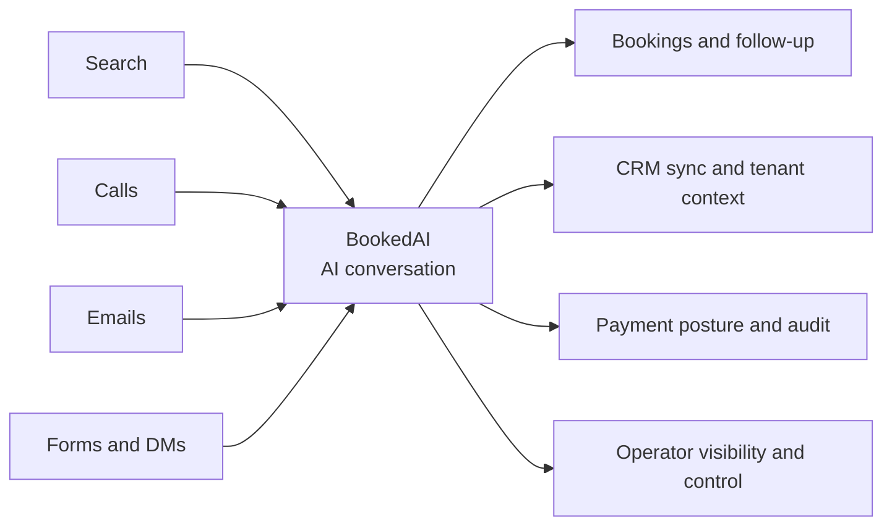

# BookedAI slide 1 visual spec

## Goal
Redesign slide 1 as a clear visual hero instead of a text-only opener.

## Visual brief
- audience: investors, partners, early operators
- goal: explain BookedAI in under 5 seconds
- structure: inbound chaos -> BookedAI engine -> revenue outcomes
- tone: premium dark SaaS, calm confidence
- format: hero infographic for investor deck

## Mermaid flow

## Image prompt
Create a premium 16:9 investor-deck infographic for BookedAI in a dark SaaS style with cyan and violet accents. Show fragmented inbound channels on the left, including search, calls, emails, forms, and DMs. In the center, show a strong BookedAI engine block labeled AI conversation and booking intent. On the right, show revenue outcomes: bookings, CRM sync, payment posture, audit, and operator control. Keep the composition clean, high contrast, and readable in under five seconds. Avoid generic robots, stock-photo people, cluttered dashboards, and tiny text.

## Asset
- `/workspace/bookedai.au/docs/development/assets/bookedai-slide-01-infographic.svg`
