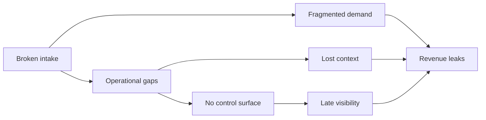

# BookedAI slide 2 visual spec

## Goal
Turn the problem slide into a fast-read visual instead of three text cards.

## Visual brief
- audience: investors and strategic partners
- goal: show exactly where revenue breaks down
- structure: broken intake -> operational gaps -> no control surface
- tone: premium dark SaaS, slightly warning-oriented but still polished
- format: 16:9 problem infographic

## Mermaid flow

## Image prompt
Create a premium 16:9 investor-deck infographic in a dark SaaS style with restrained warning colors, mainly deep navy with rose and amber highlights. Show three connected failure points from left to right: broken intake, operational gaps, and no control surface. Each block should feel like a clean product or process risk panel, not a generic business icon slide. End with one clear bottom summary showing revenue leaks between inquiry and booked outcome. Keep the layout readable in under five seconds. Avoid stock-photo people, clutter, generic robot imagery, and tiny labels.

## Asset
- `/workspace/bookedai.au/docs/development/assets/bookedai-slide-02-problem-flow.svg`
