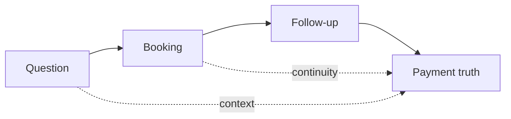

# BookedAI slide 3 visual spec

## Goal
Turn the insight slide into a strong visual bridge between problem and solution.

## Visual brief
- audience: investors and strategic partners
- goal: explain why the product wedge is not just AI, but continuity
- structure: question -> booking -> follow-up -> payment truth
- tone: premium dark SaaS, calm and strategic
- format: 16:9 continuity infographic

## Mermaid flow

## Image prompt
Create a premium 16:9 investor-deck infographic in a dark SaaS style with cyan and violet accents. Show four connected steps from left to right: question, booking, follow-up, and payment truth. The main idea is continuity, not complexity. The design should communicate that one system preserves context across the whole path. Keep the layout readable in under five seconds, clean, strategic, and polished. Avoid generic robots, tiny labels, and crowded dashboard visuals.

## Asset
- `/workspace/bookedai.au/docs/development/assets/bookedai-slide-03-insight-continuity.svg`
