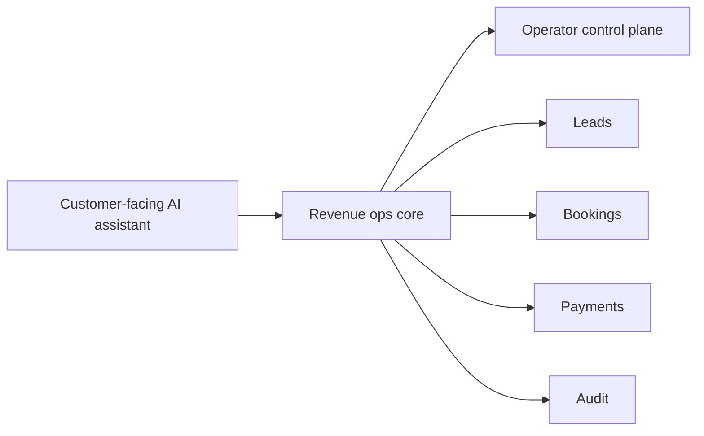

# BookedAI slide 4 visual spec

## Goal
Explain the solution as one connected system, not two separate feature lists.

## Mermaid flow

## Image prompt
Create a premium 16:9 investor-deck infographic in a dark SaaS style with cyan and violet accents. Show three connected zones: customer-facing AI assistant on the left, a strong central revenue-ops core, and an operator-facing control plane on the right. The central block should imply leads, bookings, payments, and audit as one managed operating system. Keep the composition clean, balanced, and readable in under five seconds. Avoid generic stock-photo elements, cluttered dashboards, and tiny labels.

## Asset
- `/workspace/bookedai.au/docs/development/assets/bookedai-slide-04-solution-system.svg`
