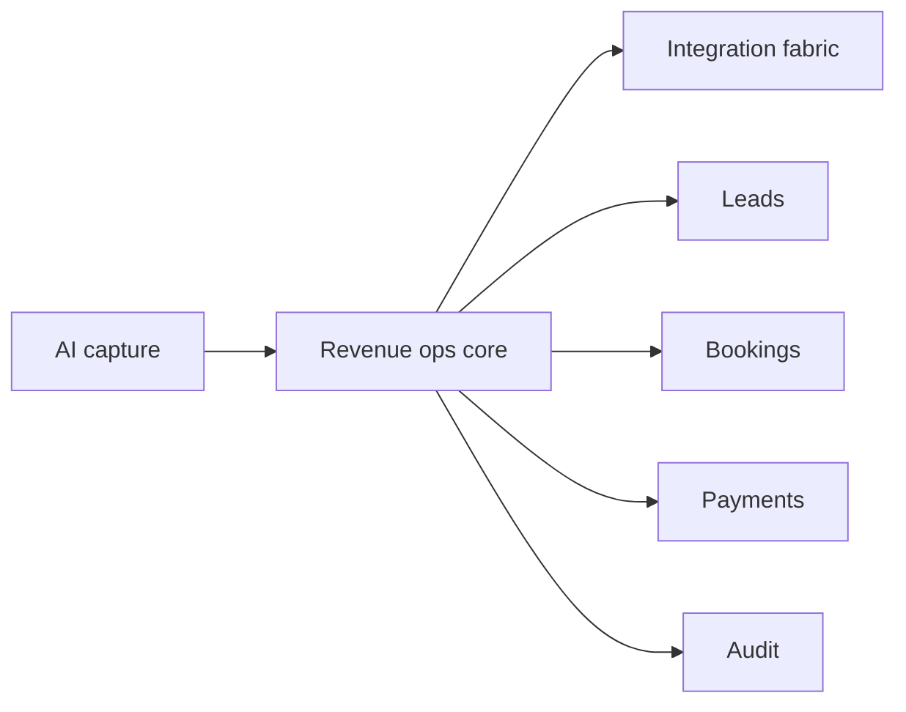

# BookedAI slide 6 visual spec

## Goal
Frame the product as a platform stack instead of a flat feature list.

## Mermaid flow

## Asset
- `/workspace/bookedai.au/docs/development/assets/bookedai-slide-06-product-platform.svg`
