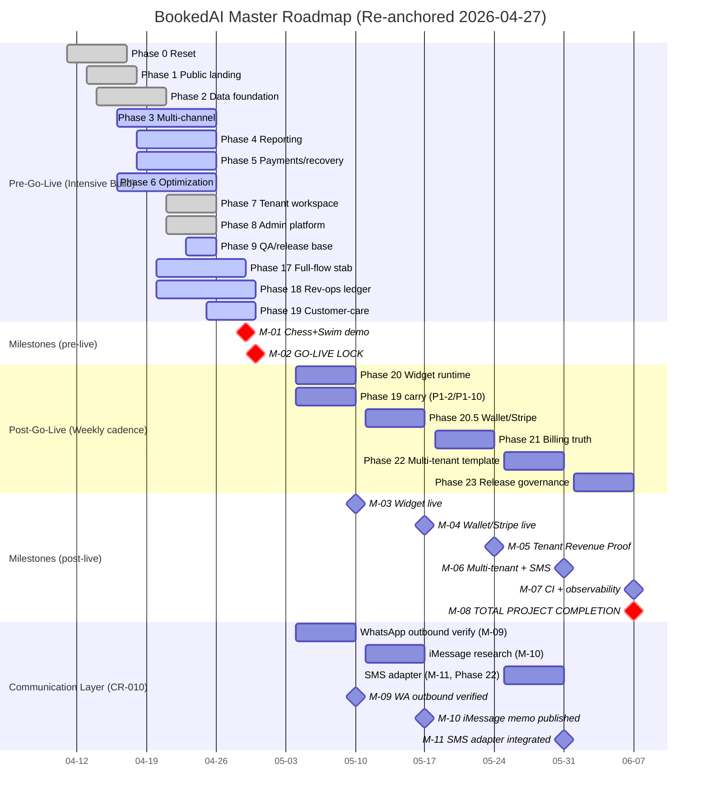

# Big-Picture Visual (06)

Date: `2026-04-27` (re-anchored)

Status: `active one-page visual summary`

Authority: tài liệu này là one-page visual companion cho [01-MASTER-ROADMAP-SYNCED.md](01-MASTER-ROADMAP-SYNCED.md). Không tạo mới scope/date — chỉ visualize những gì §1-§7 master roadmap đã commit.

## 1. Timeline strip — `2026-04-11 → 2026-06-07` (8 weeks / 58 days)

```
2026-04-11        2026-04-29   2026-05-04        2026-06-07
 │                     │           │                     │
 │  WEEK 1   WEEK 2   WEEK 3   WEEK 4..WEEK 8   END
 │  (9d)    (7d)     (4d)     (5x 7d weeks)
 │
 ├─P0─P1─P2─P3──┐
 │              ├─P4─P5─P6─P7─P8─P9──┐
 │                                   ├─P17──┐
 │                                          ├─P18─┐
 │                                                ├─P19─┐
 │                                                      │
 │                       Today (Mon 4/27) ───►          │
 │                                                      │
 │                                  M-01 (Wed 4/29) ───►│
 │                                                      │
 │                                  M-02 GO-LIVE (Thu 4/30) ─►
 │                                                      │
 │                            P20 (Wk1) ──► M-03 (5/10) │
 │                                  P20.5 (Wk2) ──► M-04 (5/17)
 │                                  P21 (Wk3) ──► M-05 (5/24)
 │                                  P22 (Wk4) ──► M-06 (5/31)
 │                                  P23 (Wk5) ──► M-07 + M-08 (6/7)
 │
 └─ Phase 0 start (Sat)                          Total project END
```

## 2. Mermaid Gantt (machine-readable)



## 3. Swim-lane visual (ASCII fallback) — workstream × week

Workstreams: `FE` Frontend / `BE` Backend / `AI` AI lane / `DV` DevOps / `QA` Quality / `GT` GTM-Content / `PM` Product/PM.

```
Workstream\Week | W1     | W2     | W3       | W4    | W5    | W6    | W7    | W8
                | 4/11-19| 4/20-26| 4/27-30  | 5/4-10| 5/11-17|5/18-24|5/25-31|6/1-7
                |        |        | GO-LIVE  |       |       |       |       | END
----------------|--------|--------|----------|-------|-------|-------|-------|-------
FE Frontend     | P1 P3  | P4 P7  | P17 P18  | P20   | P20.5 | P21   | P22   | P23
                |        | P8 P17 | P19      | (carry)| BC-2  | dash  | tmpl  | docs
BE Backend      | P0 P2  | P5 P7  | P17 P18  | P20   | P20.5 | P21   | P22   | P23
                | P3     | P9 P19 | P19 P23ovly| widget|wallet|billing|SMS+    |obs
AI lane         |        | P3 P19 | P19 chess+| P19   | -     | -     | tmpl  | -
                |        |        | swim demo | carry |       |       | playbk|
DV DevOps       | -      | P6 P9  | P23 (P0-7,| obs   | obs   | obs   | rate  | CI
                |        | release| P0-8)+rls | bring | bring | bring | limit | M-07
                |        | gates  | go-live   | -up   | -up   | -up   |       | wired
QA Quality      | -      | P6 P9  | smoke +   | wid   | wallet| Rev   | chaos | doc
                |        | replay | release   | smoke | smoke | Proof | test  | sync
                |        | gate   | gate green|       |       | UAT   |       | gate
GT GTM-Content  | P0 P1  | -      | content + | A/B   | -     | CW-6  | CW-4  | -
                | brand  |        | release   | wave1 |       | tier  | CW-5  |
                |        |        | comms     |       |       | reframe| DS-1 |
PM Product/PM   | P0 PRD | full-  | P0 freeze | wide  | scope | OQ    | hire  | M-08
                |        | stack  | + closeout| review| lock  | close | dec   | clse
                |        | review | + CR-009  |       | OQ-005| OQ-3,5|       | cere
                |        |        | + CR-010  |       |       |       |       |
Comms-Layer     | -      | -      | TG-only   | M-09  | M-10  | -     | M-11  | -
(CR-010)        |        |        | (P0); WA  | WA out| iMess | -     | SMS   |
                |        |        | inbound P1| verify| memo  |       | adapt |
                |        |        | embed AI  |       |       |       | (P22) |
                |        |        | Mentor P0 |       |       |       |       |
----------------|--------|--------|----------|-------|-------|-------|-------|-------
MILESTONE       | -      | UAT    | M-01,M-02| M-03  | M-04  | M-05  | M-06  | M-07
                |        | gate   | (CRIT)   | M-09  | M-10  |       | M-11  | M-08
```

## 4. Critical Path (highlighted)

The longest dependency chain that determines the total project duration:

```
[Phase 0 Reset] ──► [Phase 17 Full-flow stab] ──► [M-01 chess+swim] ──► [M-02 GO-LIVE]
                                                                              │
                                                                              ▼
[Phase 20 Widget] ──► [M-03] ──► [Phase 20.5 Wallet] ──► [M-04] ──► [Phase 21 Billing] ──► [M-05]
                                                                                                │
                                                                                                ▼
                                                              [Phase 22 Multi-tenant] ──► [M-06]
                                                                                                │
                                                                                                ▼
                                                              [Phase 23 Release gov] ──► [M-07/M-08 END]
```

Total critical path = 58 days (`2026-04-11 → 2026-06-07`).

Slack per critical-path node:

- Phase 0 → Phase 17: 13 days (Apr 17 → Apr 30) buffer for stabilization
- Phase 17 → M-01: 0 days (Phase 17 ends Apr 29 = M-01)
- M-01 → M-02: 1 day (Wed → Thu) — TIGHT, hardest single risk
- Each post-go-live week → next: 0 days (back-to-back Mon-Sun cadence)

## 5. Decision points (linked to Open Questions)

Marked on the timeline where leadership decisions must close to keep critical path:

| Decision | Latest date | Open Question | Affected milestone |
|---|---|---|---|
| WhatsApp provider posture | `2026-04-29` | [OQ-001](../09-OPEN-QUESTIONS.md) | M-02 |
| P0 feature freeze scope | `2026-04-28` | [OQ-002](../09-OPEN-QUESTIONS.md) | M-02 |
| Pricing tier names + commission % | `2026-05-15` | [OQ-003](../09-OPEN-QUESTIONS.md) | M-05 |
| First investor reference tenant | `2026-05-15` | [OQ-004](../09-OPEN-QUESTIONS.md) | M-05 |
| Tenant Revenue Proof metric set | `2026-05-15` | [OQ-005](../09-OPEN-QUESTIONS.md) | M-05 |
| Beta DB isolation | `2026-05-31` | [OQ-006](../09-OPEN-QUESTIONS.md) | M-07 |
| OpenClaw operator authority | ongoing | [OQ-007](../09-OPEN-QUESTIONS.md) | M-02 + M-07 |
| Compliance + due-diligence checklist owner | `2026-05-24` | [OQ-008](../09-OPEN-QUESTIONS.md) | M-05 |
| Hiring / capacity before Phase 22 | `2026-05-15` | [OQ-009](../09-OPEN-QUESTIONS.md) | M-06 |
| SMS / Apple Messages timing | `2026-05-22` | [OQ-010](../09-OPEN-QUESTIONS.md) | M-06 |
| Canonical architecture layer map | `2026-05-31` | [OQ-011](../09-OPEN-QUESTIONS.md) | M-07 |
| Observability error tracker choice | `2026-05-10` | [OQ-012](../09-OPEN-QUESTIONS.md) | M-03 + M-07 |

## 6. At-a-glance status (today = 2026-04-27)

```
┌────────────────────────────────────────────────────────────────┐
│ TODAY: 2026-04-27 (Mon)                                        │
│ DAYS TO M-01: 2  (Wed 4/29)                                    │
│ DAYS TO M-02 GO-LIVE: 3  (Thu 4/30)                            │
│ DAYS TO TOTAL PROJECT END: 41  (Sun 6/7)                       │
├────────────────────────────────────────────────────────────────┤
│ Phases active right now: 17, 18, 19, 23 overlay                │
│ P0 closed: P0-1, P0-3, P0-4 (code), P0-5, P0-7, P0-8           │
│ P0 carried/decision-only: P0-2 (Twilio default), P0-6 (CI)     │
│ At-risk milestones: M-01, M-02 (compressed window)             │
│ Open CRs: 2 (CR-007 Apple cert, CR-008 hiring)                 │
│ Accepted CRs (2026-04-27 update): CR-009 (AI Mentor 1-1),      │
│   CR-010 (Telegram-only pre go-live), CR-011 (Stripe defer),   │
│   CR-012 (Zoho CRM await creds)                                │
│ Deferred CRs: 3 (CR-003 dashboard scope, CR-004 SMS, CR-006 CI)│
└────────────────────────────────────────────────────────────────┘
```

## 7. Tenant runtimes (go-live, 3 tenants per [CR-009](05-CHANGE-REQUESTS.md))

```
┌──────────────────────────────────────────────────────────────────────┐
│ Co Mai Hung Chess                                                    │
│   Primary surface: Telegram (Manager Bot)                            │
│   Status: chess academy parent flow proof case in active build       │
│                                                                      │
│ Future Swim                                                          │
│   Primary surface: Telegram (Manager Bot) + Tenant runtime           │
│   Status: Future Swim Miranda URL hotfix live (migration 020)        │
│                                                                      │
│ AI Mentor 1-1  (slug: ai-mentor-doer; tagline: "Convert AI to        │
│                 your DOER"; tenant seeded 2026-04-21 via             │
│                 migration 013)                                       │
│   Primary surface: Embed widget on https://ai.longcare.au/           │
│                    + plugin embed via                                │
│       https://product.bookedai.au/partner/ai-mentor-pro/embed        │
│       ?embed=1&tenant_ref=ai-mentor-doer                             │
│   Catalog: 10 packages (5 private 1-1 + 5 group mentoring), USD      │
│   Status: tenant seeded; embed channel needs production-verify       │
│           at D-1 rehearsal 11:30 slot per CR-009                     │
└──────────────────────────────────────────────────────────────────────┘

Channel scope per CR-010 (2026-04-27):
  P0 channels at go-live (2026-04-30):
    - Telegram inbound + outbound (Manager Bot)
    - Embed widget (AI Mentor 1-1)
  P1 channels (acceptable, not gating):
    - WhatsApp inbound (already shipped)
  Post-go-live communication-layer milestones:
    - M-09 WhatsApp outbound verify     (W4: 2026-05-04 → 2026-05-10)
    - M-10 iMessage research            (W5: 2026-05-11 → 2026-05-17)
    - M-11 SMS adapter integration      (W7: 2026-05-25 → 2026-05-31)
```

## Changelog

- `2026-04-27` (scope update) — Mermaid Gantt: added Communication Layer section with M-09/M-10/M-11 bars and milestones per [CR-010](05-CHANGE-REQUESTS.md). Swim-lane: added Comms-Layer lane showing TG-only at go-live + post-live weekly slots; added MILESTONE row entries for M-09/M-10/M-11. Added §7 Tenant runtimes callout listing 3 go-live tenants and their primary surfaces per [CR-009](05-CHANGE-REQUESTS.md). Updated at-a-glance status with new accepted CRs.
- `2026-04-27` initial publication (re-anchor).
